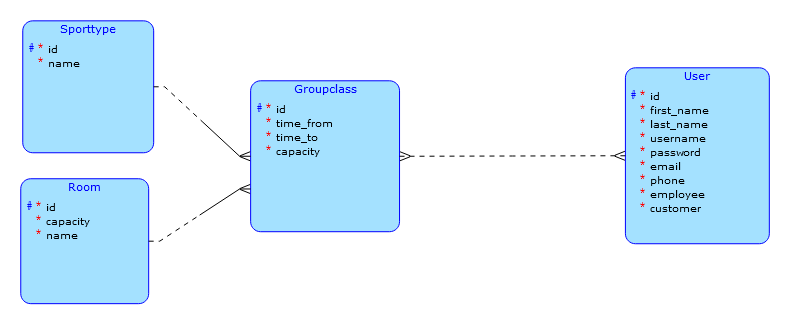

# Scheduling application for fitness center

This application enables scheduling of group classes lead by a trainer in a fitness center. It keeps track of class capacity and when the class starts and ends. If trainer tries to add class with higher capacity than room capacity, the system refuses to add this class.

Each user can find all the planned classes based on a week, current week is displayed by default. 

It stores first name, last name, email and phone number of all users as well as their username and password.

## Other info for subject BI-TJV

As implemented complex request there will be an option to count number of employees worked hours in last month.

Business operation: Adding group class. First the client sends request to ask, whether there is enough capacity in given room at given time. Then it either creates the class or it shows an error message along the lines of "Not enough capacity in this room at requested time".

