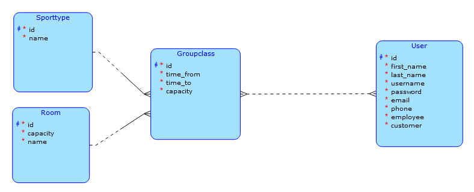

# Scheduling application for fitness center

This application enables scheduling of group classes lead by a trainer in a fitness center. It keeps track of class
capacity and when the class starts and ends. If trainer tries to add class with higher capacity than room capacity, the
system refuses to add this class.

It stores first name, last name, email and phone number of all users as well as their username and password.

## Other info for subject BI-TJV

As implemented complex request the application checks whether trainer is available or busy when adding trainer to class,
creating class
and updating class.
It also counts if capacities of all the classes in room at given time don't exceed capacity of the room.
Server looks up all the classes with given room in given timeframe and checks whether at any point the sum of capacities
of these classes are more than capacity of the room.

Business operation: Registering new user - client first sends request to check, whether given username isn't used
by another user already.
If it's taken, client notifies the user. If the username is available, client sends another request to create
user.

